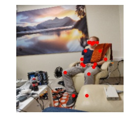

# Simple Baselines for Human Pose Estimation and Tracking
Fork from [human-pose-estimation](https://github.com/Microsoft/human-pose-estimation.pytorch) by Microsoft researchers.

Please follow their installation instructions.

Just an simple inference from the pretrained model. But it works! Below you find a couple of examples:





### Citation
If you use our code or models in your research, please cite with:
```
@inproceedings{xiao2018simple,
    author={Xiao, Bin and Wu, Haiping and Wei, Yichen},
    title={Simple Baselines for Human Pose Estimation and Tracking},
    booktitle = {European Conference on Computer Vision (ECCV)},
    year = {2018}
}
```
